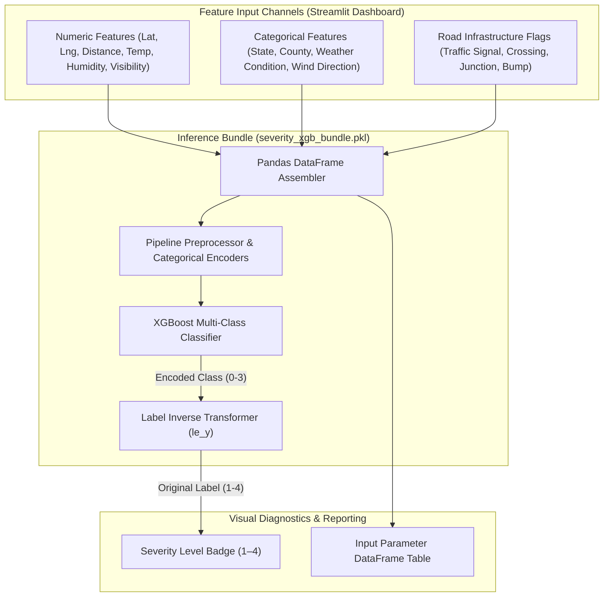

<br/><br/>

<!-- Animated Title -->
<p align="center">
  <a href="#">
    
  </a>
</p>

<p align="center">
  <b>Production Machine Learning Pipeline for Real-Time Traffic Accident Severity Classification</b><br/>
  <i>XGBoost Gradient Boosting · 4-Level Severity Categorization · Geospatial & Meteorological Feature Pipelines · Interactive Streamlit Diagnostic Studio</i>
</p>

<br/>

<!-- Badges Row 1: Core Technologies -->
<p align="center">
  
  
  
  
  
</p>

<!-- Badges Row 2: Infrastructure & Standards -->
<p align="center">
  
  
  
  
  
</p>

<br/>

<!-- Quick Navigation Bar -->
<p align="center">
  <a href="#-overview"></a>
  &nbsp;
  <a href="#-problem-statement--solution"></a>
  &nbsp;
  <a href="#-severity-index-definitions"></a>
  &nbsp;
  <a href="#%EF%B8%8F-system-architecture"></a>
  &nbsp;
  <a href="#-feature-engineering--pipeline"></a>
  &nbsp;
  <a href="#-quickstart--execution"></a>
</p>

---

## 📌 Overview

**Road Accident Severity Prediction** is a machine learning platform engineered to forecast the impact severity of vehicular traffic accidents across the United States. Utilizing high-capacity **XGBoost (Extreme Gradient Boosting)** ensembles trained on the massive US Accidents dataset, the system maps intricate interactions between **geospatial coordinates**, **atmospheric weather metrics**, **temporal twilight indicators**, and **road infrastructure safety points**.

The platform provides an end-to-end inferencing pipeline wrapped in an interactive **Streamlit diagnostic studio**, enabling civil traffic authorities, emergency response dispatchers, and insurance actuaries to test scenario combinations and assess risk levels in real time.

```
                    ┌────────────────────────────────────────────────────────┐
                    │             Accident Severity Engine                   │
                    │                                                        │
[ Weather Metrics /]┼──> [ Pipeline Encoder & Transformer ]                  ├──> [ Calibrated Verdict ]
[ Geo Coordinates /]│             │                                          │    - Severity Level (1 to 4)
[ Road Attributes  ]│             ▼                                          │    - Impact Duration Estimation
                    │    [ Multi-Class XGBoost Ensemble ] ──> Class Logits   │    - Emergency Resource Tier
                    │             │                                          │    - Diagnostic Breakdown
                    │             ▼                                          │
                    │    [ Label Decoder (le_y) ]         ──> Final Severity │
                    └────────────────────────────────────────────────────────┘
```

---

## 🎯 Problem Statement & Solution

<table>
<tr>
<td width="50%" valign="top">

### ❌ The Traffic Safety Challenge

Emergency services and transit planners face major operational risks:

- 🚑 **Delayed Resource Dispatch**: Inaccurate initial reports prevent dispatchers from routing appropriate emergency tiers (ambulances vs. airlifts).
- 🌧️ **Unpredictable Microclimates**: Extreme shifts in humidity, visibility, and wind drastically change highway braking dynamics.
- 🚧 **Complex Roadway Factors**: Intersections, traffic signals, and speed humps compound accident severity in non-linear ways.
- 📈 **High Dimensionality**: Raw accident logs contain dozens of sparse categorical variables (counties, airports, weather codes).

</td>
<td width="50%" valign="top">

### ✅ The Machine Learning Solution

| Challenge | Architectural Solution |
| :--- | :--- |
| **Non-Linear Interactions** | **XGBoost Decision Trees**: Captures complex non-linear combinations between road features, temperature, and coordinates. |
| **Comprehensive Feature Scope** | Encodes **Numeric** (Distance, Visibility), **Categorical** (States, Weather), and **Boolean** roadway flags. |
| **Integrated Pipeline Bundle** | Serialized **Joblib Pipeline Bundle** (`severity_xgb_bundle.pkl`) managing encoding and inference in a single step. |
| **Interactive Scenario Testing** | Instant parameter adjustments via **Streamlit** with instant multi-class output. |

</td>
</tr>
</table>

---

## 🔥 Severity Index Definitions

The target variable represents four standardized severity tiers calibrated to the official US Department of Transportation reporting scale:

| Level | Severity Classification | Traffic & Structural Impact | Response Protocol |
| :---: | :--- | :--- | :--- |
| **1** | **Minor / Incidental** | Negligible traffic delay; vehicles quickly moved to shoulder. Minimal damage. | Standard roadside assistance |
| **2** | **Moderate** | Single-lane obstruction; moderate localized congestion ($<30$ mins delay). | Local traffic patrol |
| **3** | **Severe** | Multi-lane blockage; significant traffic disruption ($30$–$90$ mins delay). | Emergency medical & towing units |
| **4** | **Catastrophic / Critical** | Complete road closure; major structural damage or hazardous material spillage. | Full emergency multi-agency response |

---

## 🏗️ System Architecture

The architecture decouples model development from interactive inference via a clean serialized pipeline bundle:



---

## 🔬 Feature Engineering & Pipeline

The trained model bundle (`severity_xgb_bundle.pkl`) encapsulates the complete feature matrix:

### 1. Numeric Variables
- **Geographic Coordinates**: `Start_Lat`, `Start_Lng`
- **Impact Radius**: `Distance(mi)`
- **Atmospheric Conditions**: `Temperature(F)`, `Humidity(%)`, `Pressure(in)`, `Visibility(mi)`

### 2. Categorical & Environmental Variables
- **Jurisdictions**: `State` (all 50 US States), `County`, `City`, `Timezone`, `Country`
- **Aviation / Station**: `Airport_Code`
- **Meteorology**: `Wind_Direction`, `Weather_Condition`
- **Astronomical Twilight Cycles**: `Sunrise_Sunset`, `Civil_Twilight`, `Nautical_Twilight`, `Astronomical_Twilight`

### 3. Roadway Infrastructure Boolean Flags
Binary flags indicating proximity to physical road attributes:
- `Amenity`, `Bump`, `Crossing`, `Give_Way`, `Junction`, `No_Exit`, `Railway`, `Roundabout`, `Station`, `Stop`, `Traffic_Calming`, `Traffic_Signal`, `Turning_Loop`.

---

## ⚙️ Technical Stack

| Component | Technology | Purpose & Implementation |
| :--- | :--- | :--- |
| **Model Framework** | **XGBoost** | High-performance gradient boosted decision trees for multi-class classification |
| **Preprocessing & Pipeline** | **Scikit-Learn** | Pipeline composition, categorical encoders, and label transformations |
| **Interactive Interface** | **Streamlit** | Rapid diagnostic web dashboard with real-time slider and selectbox controls |
| **Data Structures** | **Pandas & NumPy** | Vectorized table manipulation and input parsing |
| **Model Serialization** | **Joblib** | Serialization of the unified model, encoders, and feature column registries |
| **Container Environment** | **VS Code DevContainer** | Pre-configured environment for cloud and local containerized workflows |

---

## 📁 Repository Structure

```
Road-Accident-Severity-Prediction/
├── 📄 app.py                           # Interactive Streamlit dashboard & prediction script
├── 📄 severity_xgb_bundle.pkl          # Serialized XGBoost model pipeline & label encoders
├── 📄 requirements.txt                 # Runtime dependencies
├── 📁 .devcontainer/                   # Development container definitions
└── 📄 README.md                        # Documentation
```

---

## 🚀 Quickstart & Execution

### Prerequisites
- **Python**: 3.10 or higher
- **Virtual Environment**: Recommended

---

### 1. Installation

```bash
# 1. Clone repository
git clone https://github.com/IbrahimAbdelsattar/Road-Accident-Severity-Prediction.git
cd Road-Accident-Severity-Prediction

# 2. Create virtual environment
python -m venv venv
source venv/bin/activate        # On Windows: .\venv\Scripts\activate

# 3. Install dependencies
pip install -r requirements.txt
pip install streamlit xgboost scikit-learn pandas joblib
```

---

### 2. Running the Severity Dashboard

```bash
streamlit run app.py
```

*The interface will automatically launch at `http://localhost:8501`.*

---

## 👥 Author & Connect

**Ibrahim Abdelsattar**  
*AI Engineer & Machine Learning Specialist*

- 🌐 **GitHub**: [@IbrahimAbdelsattar](https://github.com/IbrahimAbdelsattar)
- 💼 **LinkedIn**: [Ibrahim Abdelsattar](https://www.linkedin.com/in/ibrahim-abdelsattar/)
- 📧 **Email**: [ibrahimabdelsattar042@gmail.com](mailto:ibrahimabdelsattar042@gmail.com)

---

<p align="center">
  <sub>Engineered for transit safety intelligence & automated collision analytics. © 2026 Road Accident Severity.</sub>
</p>
